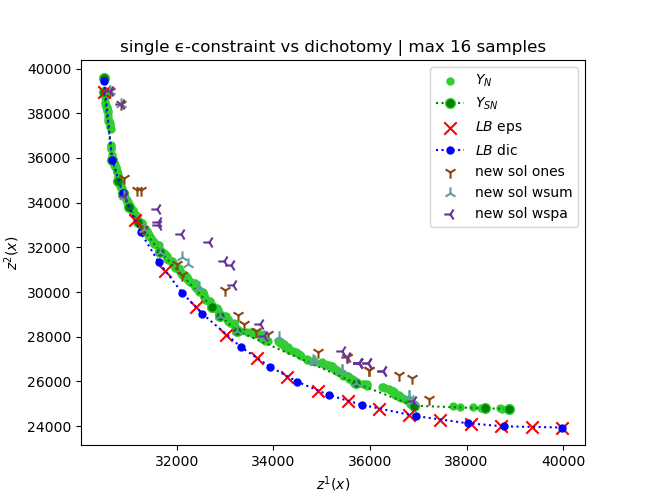

# MOS

## Starting point
Generators created using ε-constraint and dicotomic search on the realaxed problem (linear relaxation).

 - $I \in \{1,\dots, |I|\}$, the set of variables.
 - $J \in \{1,\dots, |J|\}$, the set of constraints.
 - $A_{ij}, ~ ~ \forall i \in I, \forall j \in J$, the matrix of constraints.
 - $x_{i} \in \{0, 1\}, ~ ~ \forall i \in I$, the binary variables.

## First idea
Starting from each generator, fix each variable which were set to one (resp. zero) to one (resp. zero) and solve the model aiming for an integer solution. This way the total number of variable will greatly deminish leaving as variable only the one with floating values in the generator.

The reasult shown this method to be perfectly useless as fixing most variable reder the model infeasible in most case (if not all).

## Second idea 
Starting from each generator, compute an integer solution that minimize only the difference between the floating generator and a newly computed integer solution. 

Thus we introduce $y$ a binary variable to determine if a variable changed of value compared to the generator.
 - $I' \subset I$, include each variable index where the generator has for value one or zero.
 - $y_{i} \in \{0, 1\}, ~ ~ \forall i \in I'$, is equal to $1$ if the value of the solution for the variable of index $i$ is differrent of the generator one. Otherwise $0$.

To enforce the $y$ behavior we add two type of constraint to the model. For each variable which were equal to one in the generator will be penalized if switched to zero: 
$x_i ≥ 1 - y_i$.
Reciprocly the variables set to zero in the generator will penalize the function if switched to one.
$x_i ≤ y_i$.

The last step if to compute how much switching a variable will penalize the solution. In first place we will experience a couple of different objective function.

 - **Penality of one: (ones)** switching a variable will be penalized by one: 
$$\min \sum_{i \in I} y_i$$
 - **Weighted sum: (wsum)** the penality will be proportional to each objective function: 
$$\min \sum_{j \in J} y_j \cdot \frac{c_{1j} + c_{2j}}{\max_{k \in I}(c_{1k}) + \max_{k \in I}(c_{2k})}$$
 - **SPA interest: (wspa)** the penality will depend on the intterest toward the variable in the context of a SPA problem:
$$ \sum_{i \in I} y_i \cdot \frac{c_{1i} + c_{2i}}{\sum_{j \in J} A_{ij}}$$

